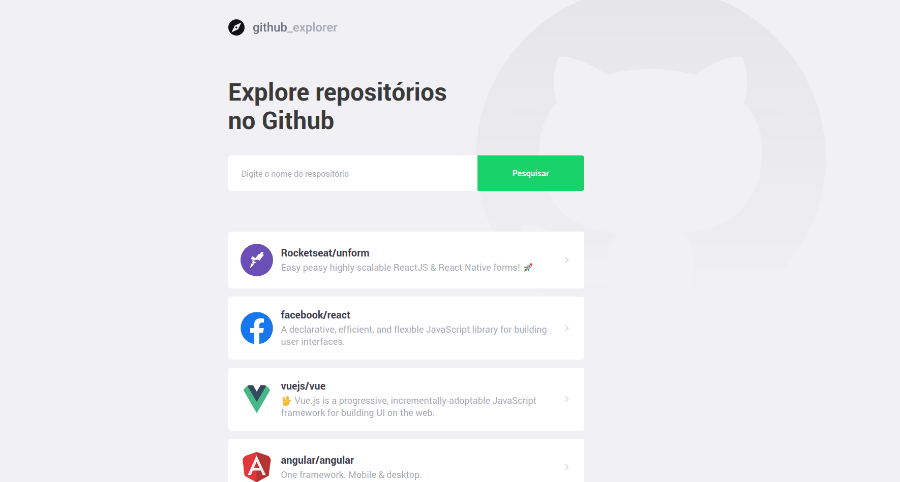

<p align="center">
  
</p>

<h3 align="center">
  Find all the repositories in the Github! :octocat:
</h3>

<p align="center">
  The application aims to find any repository hosted on github, in addition to allowing you to view a list of open issues
</p>

<p align="center">
  

  

  

  <a href="https://github.com/tiagobehenck">
    
  </a>

  

  
</p>

<p align="center">
  <a href="#hammer-technology">Technology</a>&nbsp;&nbsp;&nbsp;|&nbsp;&nbsp;&nbsp;
  <a href="#wrench-installation">Installation</a>&nbsp;&nbsp;&nbsp;|&nbsp;&nbsp;&nbsp;
  <a href="#construction-new-features">New Features</a>&nbsp;&nbsp;&nbsp;|&nbsp;&nbsp;&nbsp;
  <a href="#octocat-how-to-contribute">How to contribute</a>
</p>

## :hammer: Technology

- [ReactJS](https://reactjs.org/)
- [Styled-components](https://www.styled-components.com/)
- [ESLint](https://eslint.org/)
- [Prettier](https://prettier.io/)
- [EditorConfig](https://editorconfig.org/)
- [VS Code](https://code.visualstudio.com/)

## :wrench: Installation

### :computer: Web

```
  // 1 - Git Clone
  git clone https://github.com/TiagoBehenck/github-explorer

  // 2 - Installing the dependencies
  cd github-explorer && yarn install

  // 3 - Run the application
  yarn start

```

### View

<p align="center">
  
</p>

### :construction: New features

- [ ] Dark mode
- [ ] Delete repository


## :octocat: How to contribute

- Fork this repository;
- Create a branch with your feature: `git checkout -b my-feature`;
- Commit your changes: `git commit -m 'feat: My new feature'`;
- Push to your branch: `git push origin my-feature`;

Made with ♥ by Tiago :wave: [See my linkedin!](https://www.linkedin.com/in/tiago-behenck-dos-santos/)
